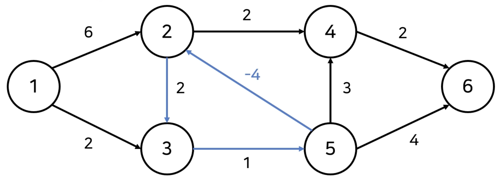
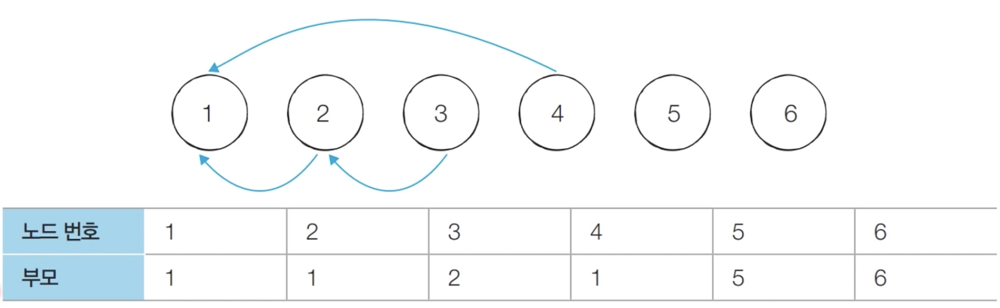
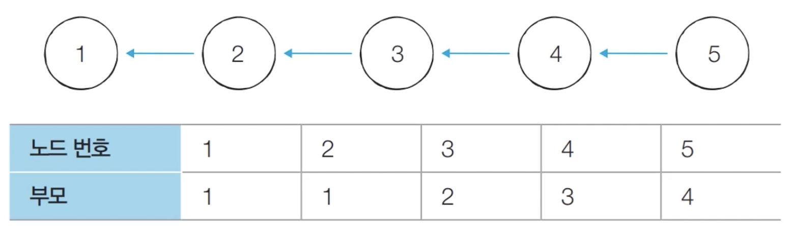
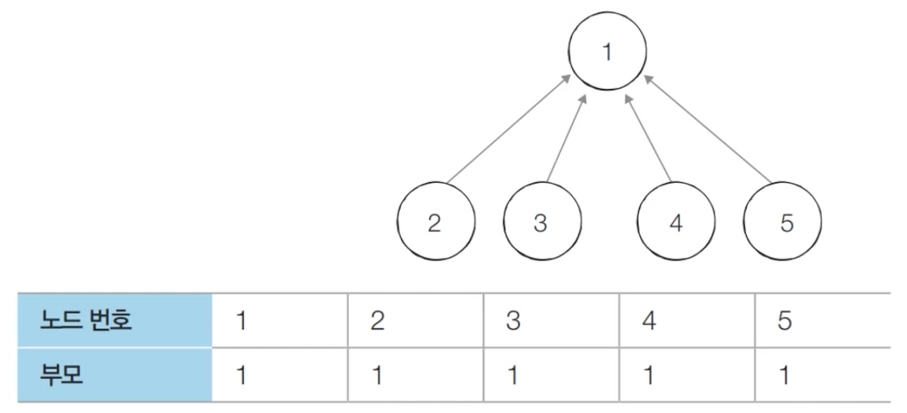
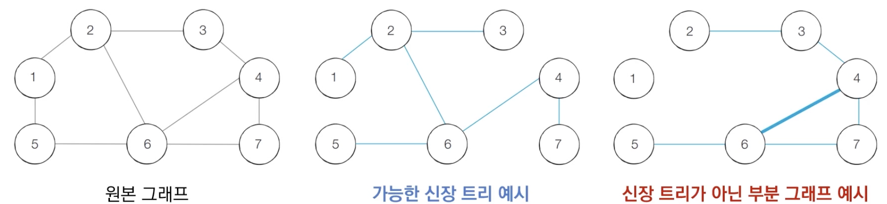

# 최적의 코딩을 결정하는 기본 알고리즘

## 1. 가장 기본이 되는 자료구조 : 스택과 큐

### 스택 자료구조
- 먼저 들어온 데이터가 나중에 나가는 형식(선입후출)의 자료구조
- 입구와 출구가 동일한 형채로 스택을 시각화할 수 있음


예시)
삽입(5) - 삽입(2) - 삽입(3) - 삽입(7) - 삭제() - 삽입(1) - 삽입(4) - 삭제()


```python
stack = []
stack.append(5)
stack.append(2)
stack.append(3)
stack.append(7)
stack.pop()
stack.append(1)
stack.append(4)
stack.pop()

print(stack[::-1]) # 최상단부터 [1, 3, 2, 5]
print(stack) # [5, 2, 3, 1]
```


### 큐 자료구조
- 먼저 들어온 데이터가 먼저 나가는 형식(선입선출)의 자료구조
- 큐는 입구와 출구가 모두 뚫려있는 터널과 같은 형태로 시각화할 수 있음


예시)
삽입(5) - 삽입(2) - 삽입(3) - 삽입(7) - 삭제() - 삽입(1) - 삽입(4) - 삭제()


```python
# 시간복잡도가 작음
from collections import deque

queue = deque()
queue.append(5)
queue.append(2)
queue.append(3)
queue.append(7)
queue.popleft()
queue.append(1)
queue.append(4)
queue.popleft()

print(queue) # 먼저 들어온 순서대로 출력 deque([3, 7, 1, 4])
queue.reverse() # 역순
print(queue) # 나중에 들어온 원소부터 출력 deque([4, 1, 7, 3])
```


## 2. 우선순위에 따라 데이터를 꺼내는 자료구조

### 우선순위 큐
- 우선순위 큐는 우선순위가 가장 높은 데이터를 가장 먼저 삭제하는 자료구조
- 우선순위 큐는 데이터를 우선순위에 따라 처리하고 싶을 때 사용


- 우선순위 큐를 구현하는 방법
    1. 단순히 리스트 이용
    2. 힙(heap)을 이용

- 데이터의 개수가 N개일 때, 구현방식에 따라 시간복잡도가 달라짐


#### 힙(Heap)의 특징
- 힙은 완전 이진 트리 자료구조
- 힙에서는 항상 루트 노트를 제거
- 최소 힙
    - 루트 노트가 가장 작은 값
    - 값이 작은 데이터가 우선적으로 제거
- 최대 힙
    - 루트 노드가 가장 큰 값
    - 값이 큰 데이터가 우선적으로 제거


#### 완전 이진 트리
- 루트 노드부터 시작하여 왼쪽 자식 노드, 오른쪽 자식 노드 순서대로 데이터가 차례대로 삽입되는 트리


#### 최소 힙 구성 함수(Min-Heapify)
- (상향식) 부모 노드로 거슬러 올라가며, 부모보다 자신의 값이 더 작은 경우에 위치를 교체
- 새로운 원소가 삽입되었을 때 O(logN)의 시간 복잡도로 힙성질 유지
- 원소가 제거되었을 때 O(logN)의 시간 복잡도로 힙성질 유지


예시)
```python
import sys
import heapq
input = sys.stdin.readline

def heapsort(iterable):
    h = []
    result = []
    for value in iterable
    heapq.heappush(h, value)

    for i in range(len(h)):
        result.append(heapq.heappop(h))
    return result

n = int(input())
arr = []

for i in range(n):
    arr.append(int(input()))

res = heapsort(arr)

for i in range(n):
    print(res[i])
```


## 3. 트리 자료 구조
- 트리 : 가계도와 같은 계층적인 구조럴 표현
    - 루트 노드 : 부모가 없는 최상위 노드
    - 단말 노드 : 자식이 없는 노드
    - 크기 : 트리에 포함된 모든 노드의 개수
    - 깊이 : 루트 노드부터의 거리
    - 높이 : 깊이 중 최댓값
    - 차수 : 각 노드(자식방향)의 간선 개수
- 트리의 크기가 N일 때, 전체 간선의 개수는 N-1개


### 이진 탐색 트리
- 이진 탐색이 동작할 수 있도록 고안된 효율적인 탐색이 가능한 자료구조
- 왼쪽 자식노드 < 부모노드 < 오른쪽 자식 노드
    - 부모 노드보다 왼쪽 자식 노드가 작다.
    - 부모 노드보다 오른쪽 자식 노드가 크다.


#### 트리의 순회
- 트리 자료구조에 포함된 노드를 특정한 방법으로 한 번씩 방문하는 방법
    - 트리의 정보를 시각적으로 확인가능

- 전위 순회 : 루트를 먼저 방문
- 중위 순회 : 왼쪽 자식을 방문한 뒤에 루트 방문
- 후위 순회 : 오른쪽 자식을 방문한 뒤에 루트 방문


## 4. 바이너리 인덱스 트리
- 바이너리 인덱스 트리(펜윅트리) : 2진법 인덱스 구조를 활용해 구간 합 문제를 효과적으로 해결할 수 있는 자료구조
ex)
7 = 00000000 0000111
-7 = 11111111 1111001 (7에서 1로 모두 전환 후 1을 더한 값)

- 0이 아닌 마지막 비트를 찾는 방법
: 특정한 숫자 K의 0이 아닌 마지막 비트를 찾기 위해서는 K & -K를 계산하면 됨

```python
n = 8

for i in range(n+1):
    print(i, '의 마지막 비트:', (i & -i))

# 0의 마지막 비트 : 0
# 1의 마지막 비트 : 1
# 2의 마지막 비트 : 2
# 3의 마지막 비트 : 1
# 4의 마지막 비트 : 4
# 5의 마지막 비트 : 1
# 6의 마지막 비트 : 2
# 7의 마지막 비트 : 1
# 8의 마지막 비트 : 8
```

- 트리구조 만들기 : 0이 아닌 마지막 비트 = 내가 저장하고 있는 값들의 개수
- 특정값을 변경할 때 : 0이 아닌 마지막비트만큼 더하면서 구간들의 값을 변경 (예시 3)


- 1부터 N까지의 합(누적 합) 구하기 : 0이 아닌 마지막 비트만큼 빼면서 구간들의 값의 합 계산


```python
import sys
input = sys.stdin.readline

# 데이터의 개수(n), 변경 횟수(m), 구간 합 계산 횟수(k)
n, m, k = map(int, input().split())

# 전체 데이터의 개수는 최대 1,000,000개
arr = [0] * (n+1)
tree = [0] * (n+1)

# i번째 수까지의 누적 합을 계산하는 함수
def prefix_sum(i):
    result = 0
    while i > 0:
        result += tree[i]
        # 0이 아닌 마지막 비트만큼 빼가면서 이동
        i -= (i&-i)
        return result

# i번째 수를 dif만큼 더하는 함수
def update(i, dif):
    while i <= n:
        tree[i] += dif
        i += (i&-i)
    return i

# start부터 end까지의 구간 합을 계산하는 함수
def interval_sum(start, end):
    return prefix_sum(end) - prefix_sum(start-1)

for i in range(1, n+1):
    x = int(input())
    arr[i] = x
    update(i, x)

for i in range(m+k):
    a, b, c = map(int, input().split())
    # 업데이트(update) 연산인 경우
    if a == 1:
        update(b, c-arr[b]) # 바뀐 크기(dif)만큼 적용
        arr[b] = c
    # 구간 합(interval sum) 연산인 경우
    else:
        print(interval_sum(b, c))
```


## 5. 선텍정렬과 삽입정렬
- 정렬(Sorting) : 데이터를 특정한 기준에 따라 순서대로 나열

#### 선택 정렬
- 처리되지 않은 데이터 중에서 가장 작은 데이터를 선택해 맨 앞에 있는 데이터와 바꾸는 것을 반복
```python
array = [7, 5, 9, 0, 3, 1, 6, 2, 4, 8]

for i in range(len(array)):
    min_index = i # 가장 작은 원소의 인덱스
    for j in range(i+1, len(array)):
        if array[min_index] > array[j] :
            min_index = j
    array[i], array[min_index] = array[min_index], array[i]

print(array) # [0, 1, 2, 3, 4, 5, 6, 7, 8, 9]
```

#### 삽입 정렬
- 처리되지 않은 데이터를 하나씩 골라 적절한 위치에 삽입
```python
array = [7, 5, 9, 0, 3, 1, 6, 2, 4, 8]

for i in range(1, len(array)):
    for j in range(i, 0, -1): # 인덱스 i부터 1까지 1씩 감소하며 반복하는 문법
        if array[j] < array[j-1]:
            array[j], array[j-1] = array[j-1], array[j]
        else: # 자기보다 작은 데이터를 만나면 그 위치에서 멈춤
            break

print(array) # [0, 1, 2, 3, 4, 5, 6, 7, 8, 9] 
```


## 6. 퀵 정렬과 계수 정렬
#### 퀵정렬
- 기준 데이터를 설정하고 그 기준보다 큰 데이터와 작은 데이터의 위치를 바꾸는 방법
- 일반적으로 기준값(pivot)은 첫번째 데이터로 함
```python
array = [5, 7, 9, 0, 3, 1, 6, 2, 4, 8]

def quick_sort(array, start, end):
    if start >= end: # 원소과 1개인 경우 종료
        return
    pivot = start
    left = start + 1
    right = end
    while(left <= right):
        # 피벗보다 큰 데이터를 찾을 때까지 반복
        while (left <= end and array[left] <= array[pivot]):
            left += 1
        # 피벗보다 작은 데이터를 찾을 때까지 반복
        while (right > start and array[right] >= array[pivot]):
            right -= 1
        if(left > right): # 엇갈렸다면 작은 데이터와 피벗을 교체
            array[right], array[pivot] = array[pivot], array[right]
        else: # 엇갈리지 않았다면 작은 데이터와 큰 데이터를 교체
            array[left], array[right] = array[right], array[left]
    # 분할 이후 왼쪽 부분과 오른쪽 부분에서 각각 정렬 수행
    quick_sort(array, start, right-1)
    quick_sort(array, right+1, end)
quick_sort(array, 0, len(array)-1)

print(array) # [0, 1, 2, 3, 4, 5, 6, 7, 8, 9]
```

```python
array = [5, 7, 9, 0, 3, 1, 6, 2, 4, 8]

def quick_sort(array):
    if len(array) <= 1:
        return array
    pivot = array[0] # 피벗은 첫번재 원소
    tail = array[1:]

    left_side = [x for x in tail if x <= pivot] # 분할된 왼쪽 부분
    right_side = [x for x in tail if x > pivot] # 분할된 오른쪽 부분

    # 분할 이후 왼쪽 부분과 오른쪽 부분에서 각각 정렬 수행하고 전체 리스트 반환
    return quick_sort(left_side) + [pivot] + quick_sort(right_side)

print(quick_sort(array)) # [0, 1, 2, 3, 4, 5, 6, 7, 8, 9]
```

#### 계수정렬
- 동일한 값을 가지는 데이터가 여러 개 등장할 때 효과적으로 사용
- 데이터가 0, 999,999인 2개의 값만 있다고 했을 때 매우 비효율적

```python
array = [7, 5, 9, 0, 3, 1, 6, 2, 9, 1, 4, 8, 0, 5, 2]
count = [0] * (max(array) + 1)

for i in range(len(array)):
    count[array[i]] += 1

for i in range(len(count)):
    for j in range(count[i]):
        print(i, end=' ')
```


## 7. DFS와 BFS
#### DFS
- 깊이우선탐색(DFS) : 깊은 부분을 먼저 탐색
1. 탐색 시작 노드를 스택에 삽입하고 방문 처리
2. 스택의 최상단 노드에 방문하지 않은 인접한 노드가 하나라도 있으면 그 노드를 스택에 넣고 방문처리\
    방문하지않은 인접노드가 없으면 스택에서 최상단 노드를 꺼냄
3. 더 이상 2번의 과정을 수행할 수 없을 때까지 반복


```python
dfs dfs(graphm v, visited):
    visited[v] = True
    print(v, end=' ')
    for i in graph[v]:
        if not visited[i]:
            dfs(graph, i, visited)

graph = [
    [],
    [2, 3, 8],
    [1, 7], 
    [1, 4, 5],
    [3, 5],
    [3, 4],
    [7],
    [2, 6, 8],
    [1, 7],
]

visited = [False] * 9
dfs(graph, 1, visited)
# 1 2 7 6 8 3 4 5
```


#### BFS
- 너비우선탐색(BFS) : 가까운 노드부터 우선적으로 탐색
- 큐 자료구조를 이용
1. 탐색 시작 노드를 큐에 삽입하고 방문 처리
2. 큐에서 노드를 꺼낸 뒤에 해당 노드의 인접 노드 중에서 방문하지 않은 노드를 모두 큐에 삽입하고 방문 처리
3. 더 이상 2번의 과정을 수행할 수 없을 때까지 반복


```python
from collections import deque

def bfs(graph, start, visited):
    queue = deque([start])
    visited[start] = True
    while queue:
        v = queue.popleft()
        print(v, end=' ')
        for i in graph[v]:
            if not visited[i]:
                queue.append(i)
                visited[i] = True

graph = [
    [],
    [2, 3, 8],
    [1, 7], 
    [1, 4, 5],
    [3, 5],
    [3, 4],
    [7],
    [2, 6, 8],
    [1, 7],
]

visited = [False] * 9
bfs(graph, 1, visited)
# 1 2 3 8 7 4 5 6
```


## 8. 다익스트라 알고리즘
1. 출발노드 설정
2. 최단 거리 테이블 초기화
3. 방문하지 않은 노드 중에서 거리가 가장 짧은 노드를 선택
4. 해당 노드를 거쳐 다른 노드로 가는 비용을 계산하여 최단거리테이블 갱신
5. 위 과정에서 3번과 4번을 반복

### 우선순위 큐
- 우선순위가 가장 높은 데이터를 가장 먼저 삭제
#### 힙
```python
# 최소 힙
import heapq

def heapsort(iterable):
    h = []
    result = []
    for value in iterable:
        heapq.heappush(h, value)

    for i in range(len(h)):
        result.append(heapq.heappop(h))
    return result

result = heapsort([1, 3, 5, 7, 9, 2, 4, 6, 8, 0])
print(result) # [0, 1, 2, 3, 4, 5, 6, 7, 8, 9]
```

```python
# 최대 힙
import heapq

def heapsort(iterable):
    h = []
    result = []
    for value in iterable:
        heapq.heappush(h, -value)

    for i in range(len(h)):
        result.append(-heapq.heappop(h))
    return result

result = heapsort([1, 3, 5, 7, 9, 2, 4, 6, 8, 0])
print(result) # [9, 8, 7, 6, 5, 4, 3, 2, 1, 0]
```


## 9. 벨만 포드 알고리즘
1. 출발 노드 설정
2. 최단거리 테이블 초기화
3. N-1번 반복
    1. 전체 간선 E개를 하나씩 확인
    2. 각 간선을 거쳐 다른 노드로 가는 비용을 계산하여 최단 거리 테이블 갱신

음수 간선 순환이 발생하는지 체크하고 싶다면 3번의 과정을 한번더 수행\
이 때, 최단 거리 테이블이 갱신된다면 음수 간선 순환이 존재

```python
import sys
input - sys.stdin.readline
INF = int(1e9)

def bf(start):
    dist[start] = 0
    for i in range(n):
        for j in range(m):
            cur = edges[j][0]
            next_node = edges[j][1]
            cost = edges[j][2]
            if dist[cur] != INF and dist[next_node] > dist[cur] + cost:
                dist[next_node] = dist[cur] + cost
                if i == n-1 :
                    return True
    return False

n, m = map(int, input().split())
edges = []
dist = [INF] * (n+1)
for _ in range(m):
    a, b, c = map(int, input().split())
    edges.append((a, b, c))

negative_cycle = bf(1)

if negative_cycle:
    print('-1')
else:
    for i in range(2, n+1):
        if dist[i] == INF:
            print('-1')
        else:
            print(dist[i])
```


- 다익스트라 알고리즘 : \
매번 방문하지 않은 노드 중에서 최단 거리가 가장 짧은 노드 선택\
음수 간선이 없다면 최적의 해를 찾을 수 있음(아래와 같은 경우 음수간선 무한루프 발생)

- 벨만 포드 알고리즘 : \
매번 모든 간선을 전부 확인(다익스트라 알고리즘에서의 최적의 해를 항상 포함) \
다익스트라 알고리즘에 비해 시간이 오래 걸리지만 음수 간선 순환을 탐지 가능


## 10. 유니온 파인드 자료 구조
- 서로소 집합(Union Find) : 공통 원소가 없는 두 집합
    - 합집합(Union) : 두 개의 원소가 포함된 집합을 하나의 집합으로 합치는 연산
    - 찾기(Find) : 특정한 원소가 속한 집합이 어떤 집합인지 알려주는 연산

- 여러 개의 합치기 연산이 주어졌을 때
1. 합집합연산을 확인하여 서로 연결된 두 노드 A, B를 확인
    1. A와 B의 루트 노드 A', B'를 각각 찾음
    2. A'를 B'의 부모 노드로 설정
2. 모든 합집합 연산을 처리할 때까지 1번 과정 반복


```python
def find_parent(parent, x):
    if parent[x] != x:
        return find_parent(parent, parent[x])
    return x

def union_parent(parent, a, b):
    a = find_parent(parent, a)
    b = find_parent(parent, b)
    if a < b:
        parent[b] = a
    else:
        parent[a] = b

v, e = map(int, input().split())
parent = [0] * (v+1)

for i in range(1, v+1):
    parent[i] = i

for i in range(e):
    a, b = map(int, input().split())
    union_parent(parent, a, b)

print('각 원소가 속한 집합: ', end='')
for i in range(1, v+1):
    print(find_parent(parent, i), end= ' ')

print()

print('부모 테이블: ', end='')
for i in range(1, v+1):
    print(parent[i], end=' ')
```

- 문제점: 합집합 연산이 편향되게 이루어지는 경우 찾기 함수가 비효율적으로 동작\
-> 이를 최적화하기 위한 방법으로 경로압축 이용



```python
def find_parent(parent, x):
    if parent[x] != x:
        parent[x] = find_parent(parent, parent[x])
    return parent[x]
```

#### 사이클 판별
- 서로소집합은 무방향 그래프 내에서의 사이클을 판별할 때 사용가능
    - 이때 방향 그래프에서의 사이클 여부는 DFS를 이용하여 판별 가능
1. 각 간선을 하나씩 확인하며 두 노드의 루트 노드를 확인
    1. 루트 노드가 서로 다르다면 두 노드에 대해 합집합 연산 수행
    2. 루트 노드가 서로 같다면 사이클 발생
2. 그래프에 포함되어 있는 모든 간선에 대해 1번 과정 반복

```python
def find_parent(parent, x):
    if parent[x] != x:
        return find_parent(parent, parent[x])
    return x

def union_parent(parent, a, b):
    a = find_parent(parent, a)
    b = find_parent(parent, b)
    if a < b:
        parent[b] = a
    else:
        parent[a] = b

v, e = map(int, input().split())
parent = [0] * (v+1)

for i in range(1, v+1):
    parent[i] = i

for i in range(e):
    a, b = map(int, input().split())
    if find_parent(parent, a) == find_parent(parent, b):
        cycle = True
        break
    else:
        union_parent(parent, a, b)
if cycle:
    print('사이클이 발생했습니다.')

else:
    print('사이클이 발생하지 않았습니다.')
```

## 11. 크루스칼 알고리즘
- 신장트리 : 그래프에서 모든 노드를 포함하면서 사이클이 존재하지 않는 부분 그래프
    - 트리조건 : 모든 노드가 포함되어 서로 연결되면서 사이클이 존재하지 않음




1. 간선 데이터를 비용에 따라 오름차순으로 정렬
2. 간선을 하나씩 확인하며 현재의 간선이 사이클을 발생시키는지 확인
    1. 사이클이 발생하지 않는 경우 최소 신장 트리에 포함
    2. 사이클이 발생하는 경우 최소 신장 트리에 포함시키지 않음
3. 모든 간선에 대해 2번의 과정 반복

```python
def find_parent(parent, x):
    if parent[x] != x:
        return find_parent(parent, parent[x])
    return x

def union_parent(parent, a, b):
    a = find_parent(parent, a)
    b = find_parent(parent, b)
    if a < b:
        parent[b] = a
    else:
        parent[a] = b

v, e = map(int, input().split())
parent = [0] * (v+1)

edges = []
result = 0

for i in range(1, v+1):
    parent[i] = i

for _ in range(e):
    a, b, cost = map(int, input().split())
    edges.append((cost, a, b))

edges.sort()

for edge in edges:
    cost, a, b = edge
    if find_parent(parent, a) != find_parent(parent, b):
        union_parent(parent, a, b)
        result += cost

print(result)
```


## 12. 최소 공통 조상
1. 모든 노드에 대한 깊이 계산
2. 최소 공통 조상을 찾을 두 노드를 확인
    1. 먼저 두 노드의 깊이가 동일하도록 거슬러 올라감
    2. 이후에 부모가 같아질 때까지 반복적으로 두 노드의 부모방향으로 거슬러 올라감
3. 모든 LCA 연산에 대하여 2번의 과정을 반복

```python
import sys
sys.setrecursionlimit(int(1e5))
n = int(input())

parent = [0] * (n+1)
d = [0] * (n+1)
c = [0] * (n+1)
graph = [[] for _ in range(n+1)]

for _ in range(n-1):
    a, b = map(int, input().split())
    graph[a].append(b)
    graph[b].append(a)

def dfs(x, depth):
    c[x] = True
    d[x] = depth
    for y in graph[x]:
        if c[y]:
            continue
        parent[y] = x
        dfs(y, depth+1)

def lca(a, b):
    while d[a] != d[b]:
        if d[a] > d[b]:
            a = parent[a]
        else:
            b = parent[b]
    while a != b:
        a = parent[a]
        b = parent[b]
    return a

dfs(1, 0)

m = int(input())

for i in range(m):
    a, b = map(int, input().split())
    print(lca(a, b))
```

- 시간복잡도 개선을 위하여 부모 관계를 설정할 때 2^i씩 거슬러 올라감
```python
import sys
input = sys.stdin.readline
sys.setrecursionlimit(int(1e5))
LOG = 21

n = int(input())
parent = [[0] * LOG for _ in range(n+1)]
d = [0] * (n+1)
c = [0] * (n+1)
graph = [[] for _ in range(n+1)]

for _ in range(n-1):
    a, b = map(int, input().split())
    graph[a].append(b)
    graph[b].append(a)

def dfs(x, depth):
    c[x] = True
    d[x] = depth
    for y in graph[x]:
        if c[y]:
            continue
        parent[y] = x
        dfs(y, depth+1)

def set_parent():
    dfs(1, 0)
    for i in range(1, LOG):
        for j in range(1, n+1):
            parent[j][i] = parent[parent[j][i-1]][i-1]

def lca(a, b):
    if d[a] > d[b]:
        a, b = b, a
    for i in range(LOG-1, -1, -1):
        if d[b] - d[a] >= (1 << i):
            b = parent[b][i]
    if a == b:
        return a
    for i in range(LOG-1, -1, -1):
        if parent[a][i] != parent[b][i]:
            a = parent[a][i]
            b = parent[b][i]
    return parent[a][0]
    
set_parent()

m = int(input())

for i in range(m):
    a, b = map(int, input().split())
    print(lca(a, b))
```


## 13. 위상 정렬
- 진입차수 : 특정한 노드로 들어오는 간선의 개수
- 진출차수 : 특정한 노드에서 나가는 간선의 개수


- 사이클이 없는 방향 그래프의 모든 노드를 방향성에 거스르지 않도록 순서대로 나열

1. 진입차수가 0인 모든 노드를 큐에 넣음
2. 큐가 빌 때까지 다음의 과정 반복
    1. 큐에서 원소를 꺼내 해당 노드에서 나가는 간선을 그래프에서 제거
    2. 새롭게 진입차수가 0이 된 노드를 큐에 넣음

- 위상 정렬은 DAG에 대해서만 수행
    - DAG : 순환하지 않는 방향 그래프
- 위상 정렬에서는 여러가지 답이 존재할 수 있음
- 모든 원소를 방문하기 전에 큐가 빈다면 사이클이 존재한다고 판단가능
- 스택을 활용한 DFS를 이용해 위상 정렬 수행 가능

```python
from collections import deque

v, e = map(int, input().split())
indegree = [0] * (v+1)
graph = [[] for i in range(v+1)]

for _ in range(e):
    a, b = map(int, input().split())
    graph[a].append(b)
    indegree[b] + =1

def topology_sort():
    result = []
    q = deque()

    for i in range(1, v+1):
        if indegree[i] == 0:
            q.append(i)
    
    while q:
        now = q.popleft()
        result.append(now)

        for i in graph[now]:
            indegree[i] -= 1
            if indegree[i] == 0:
                q.append(i)
    
    for i in result:
        print(i, end=' ')

topology_sort()
```


## 14. 재귀함수
- 자기 자신을 다시 호출하는 함수

- 최대공약수 계산(유클리드 호제법)
    - 유클리드 호제법 : 두 자연수 A, B(A > B)에 대하여 A를 B로 나눈 나머지 R이 있을 때, A와 B의 최대공약수는 B와 R의 최대공약수와 같다.

```python 
def gcd(a, b):
    if a % b == 0:
        return b
    else:
        return gcb(b, a % b)

print(gcd(192, 162)) # 6
```


## 15. 유용한 표준 라이브러리 소개
- itertools : 반복되는 형태의 데이터를 처리하기 위한 기능 제공
    - 순열, 조합
- heapq : 힙 자료구조 제공
- bisect : 이진 탐색 기능 제공
- collections : 덱, 카운터 등의 자료구조 포함
- math : 수학적 기능 제공
    - 팩토리얼, 제곱근, 최대공약수(GCD), 삼각함수 관련 함수부터 파이와 같은 상수 포함


```python
# sum()
result = sum([1, 2, 3, 4, 5]) # 15


# min(), max()
min_result = min(7, 3, 5, 2) # 2
max_result = min(7, 3, 5, 2) # 7


# eval()
result = eval('(3+5)*7') # 56


# sorted()
result = sorted([9, 1, 8, 5, 4]) # [1, 4, 5, 8, 9]
rever_result = sorted([9, 1, 8, 5, 4], reverse=True) # [9, 8, 5, 4, 1]


# sorted() with key
array = [('홍길동', 35), ('이순신', 75), ('아무개', 50)]
result = sorted(array, key=lambda x: x[1], reverse=True) # [('이순신', 75), ('아무개', 50), ('홍길동', 35)]


# 순열
from itertools import permutations
data = ['A', 'B', 'C']
result = list(permutations(data, 3)) #[('A, 'B' 'C'), ('A', 'C', 'B'), ('B', 'A', 'C'), ('B', 'C', 'A'), ('C', 'A', 'B'), ('C', 'B', 'A')]


# 조합
from itertools import combinations
data = ['A', 'B', 'C']
result = list(combinations(data, 2)) # [('A', 'B'), ('A', 'C'), ('B', 'C')]


# 중복 순열
from itertools import product
data = ['A', 'B', 'C']
result = list(product(data, repeat=2)) # 2개를 뽑는 모든 순열(중복 허용)
# [('A', 'A'), ('A', 'B'), ('A', 'C'), ('B', 'A'), ('B', 'B'), ('B', 'C'), ('C', 'A'), ('C', 'B'), ('C', 'C')]


# 중복 조합
from itertools import combinations_with_replacement
data = ['A', 'B', 'C']
result = list(combinations_with_replacement(data, 2)) # 2개를 뽑는 모든 조합(중복 허용))
# [('A', 'A'), ('A', 'B'), ('A', 'C'), ('B', 'B'), ('B', 'C'), ('C', 'C')]


# counter
from collections import Counter
counter = Counter(['red', 'blue', 'red', 'green', 'blue', 'blue'])

print(counter['blue']) # 3
print(dict(counter)) # {'red':2, 'blue':3, 'green':1}


# 최대공약수와 최소공배수
import math
def lcm(a, b):
    return a * b // math.gcd(a, b)

print(math.gcd(21, 14)) # 7
print(lcm(21, 14)) # 42
```


## 16. 소수 관련 알고리즘
- 소수 : 1보다 큰 자연수 중에서 1과 자기자신을 제외한 자연수로 나누어 떨어지지 않는 자연수

```python
def is_prime_number(x):
    for i in range(2, x):
        if x % i == 0:
            return False
    return True

print(is_prime_number(7)) # True
```

#### 약수의 성질
- 모든 약수가 가운데 약수를 기준으로 곱셈 연산에 대한 대칭을 이룸
    - 예)
    16의 약수는 1, 2, 4, 8, 16\
    이때 2 X 8 = 16 과 8 X 2 = 16은 대칭
- 따라서 특정한 자연수의 모든 약수를 찾을 때 가운데 약수(제곱근)까지만 확인하면 됨

```python
import math

def is_prime_number(x):
    for i in range(2, int(math.sqrt(x)) + 1):
        if x % i == 0:
            return False
    return True

print(is_prime_number(7)) # True
```

#### 특정한 수의 범위 안에 존재하는 모든 소수를 찾아야 할 때
- 에라토스테네스의 체 알고리즘 사용
    1. 2부터 N까지의 모든 자연수 나열
    2. 남은 수 중에서 아직 처리하지 않은 가장 작은 수 i를 찾음
    3. 남은 수 중에서 i의 배수를 모두 제거 (i는 소수이므로 제거하지 않음)
    4. 더 이상 반복할 수 없을 때까지 2번과 3번의 과정 반복

```python
import math

n = 1000
array = [True for i in range(n+1)]

for i in range(2, int(math.sqrt(n)) + 1):
    if array[i] == true:
        j = 2
        while i * j <= n:
            array[i * j] = False
            j += 1
for i in range(2, n+1):
    if array[i]:
        print(i, end=' ') 
```


## 17. 이진 탐색
- 순차 탐색 : 리스트 안에 있는 특정한 데이터를 찾기 위해 앞에서부터 데이터를 하나씩 확인
- 이진 탐색 : 정렬되어 있는 리스트에서 탐색 범위를 절반씩 좁혀가며 데이터를 탐색
    - 시작점, 끝점, 중간점을 이용하여 탐색 범위를 설정

```python
def binary_search(array, target, start, end):
    if start > end:
        return None
    mid = (start + end) // 2

    if array[mid] == traget:
        return mid
    elif array[mid] > target:
        return binary_search(array, target, start, mid-1)
    else:
        return binary_search(array, target, mid+1, end)

n, target = list(map(int, input().split()))
array = list(map(int, input().split()))

result = binary_search(array, target, 0, n-1)
if result == None:
    print('원소가 존재하지 않습니다.')
else:
    print(result+1)

input(10 7)
input(1, 3, 5, 7, 9, 11, 13, 15, 17, 19)
print(result) # 4
```

- 파이썬 이진탐색 라이브러리
    - bisect_left(a, x) : 정렬된 순서를 유지하면서 배열 a에 x를 삽입할 가장 왼쪽 인덱스 반환
    - bisect_right(a, x) : 정렬된 순서를 유지하면서 배열 a에 x를 삽입할 가장 오른쪽 인덱스 반환

```python
from bisect import bisect_left, bisect_right

a = [1, 2, 4, 4, 8]
x = 4

print(bisect_left(a, x)) # 2
print(bisect_right(a, x)) # 4
```

```python
# 값이 특정 범위에 속하는 데이터 개수 구하기
from bisect import bisect_left, bisect_right

def count_by_range(a, left_value, right_value):
    right_index = bisect_right(a, right_value)
    left_index = bisect_left(a, left_value)
    return right_index - left_index

a = [1, 2, 3, 3, 3, 3, 4, 4, 8, 9]

# 값이 4인 데이터 개수 출력
print(count_by_range(a, 4, 4)) # 2
# 값이 [-1, 3]범위에 있는 데이터 개수 출력
print(count_by_range(a, -1, 3)) # 6
```


## 18. 동적계획법
- 동적계획법(다이나믹 프로그래밍) : 메모리를 적절히 사용하여 수행 시간 효율성을 향상시키는 방법\
다음의 조건을 만족할 때 사용 가능
    - 최적부분구조 : 큰 문제를 작은 문제로 나눌 수 있으며 작은 문제의 답을 모아서 큰 문제를 해결할 수 있음
    - 중복되는 부분 문제 : 동일한 작은 문제를 반복적으로 해결해야 함

#### 피보나치 수열
a_n = a_(n-1) + a_(n-2)


``` python
def fibo(x):
    if x == 1 or x == 2:
        return 1
    return fibo(x-1) + fibo(x-2)

print(fibo(4)) # 3
```

피보나치수열은 다이나믹 프로그래밍 사용조건(최적부분구조, 중복되는 부분 문제)을 만족


```python
# 탑다운 다이나믹 프로그래밍
d = [0] * 100

def fibo(x):
    if x == 1 or x == 2:
        return 1
    if d[x] != 0:
        return d[x]
    d[x] = fibo(x-1) + fibo(x-2)
    return d[x]

print(fibo(99)) # 218922995834555169026
```

```python
# 보텀업 다이나믹 프로그래밍
d = [0] * 100

d[1] = 1
d[2] = 1
n = 99

for i in range(3, n+1):
    d[i] = d[i-1] + d[i-2]

print(d[n]) # 218922995834555169026
```


## 19. 기타 알고리즘
- 그리디(탐욕법) : 현재 상황에서 지금 당장 좋은 것만 고르는 방법
    - 정당성을 판단하는게 중요

- 투 포인터 : 리스트에 순차적으로 접근해야 할 때 두 개의 점(시작점, 끝점)의 위치를 기록하면서 처리
    - 예) 2, 3, 4, 5, 6, 7번 학생을 지목해야 할 때 2번부터 7번까지의 학생이라고 칭함

- 구간합 : 연속적으로 나열된 N개의 수가 있을 때 특정 구간의 모든 수를 합한 값을 계산
    - 접두사 합 : 배열의 맨 앞부터 특정 위치까지의 합을 미리 구해 놓은 것
