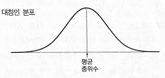
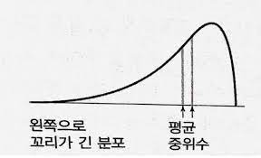

# 빅데이터 시대의 현재와 미래

## 빅데이터
- 기존의 IT 기술로는 처리하기 어려운 데이터

    활용) UPS 배송지 분석하여 최적의 경로 서칭
- 빅데이터를 활용하기 위해서는 정보를 담고 있는 데이터에서 고객과 시장에 대한 통찰력(insight) 필요
- 클라우딩 컴퓨터를 활용하여 적절한 기계학습(machine learning)으로 자동적으로 인사이트를 추출하여 현명한 의사결정에 활용

## 빅데이터를 통한 경쟁우위 달성
- 빅데이터, 인공지능, 제4차산업혁명은 데이터에 바탕을 둔(data-driven), 사실에 근거한(fact-based) 의사결정에 깊게 뿌리 내리고 있음
- 데이터분석을 통하여 고객과 시장에 대한 인사이트를 추출하여 현명한 의사결정을 할 때만이 지속가능한 경쟁우위를 창출할 수 있음
- 기업 경쟁력의 3가지 원천
    - 남들보다 낮은 비용
    - 남들이 무관심한 틈새시
    - 남들이 쉽게 모방할 수 없는 차별성

## 빅데이터시대대응방안
- 디지타이징 비즈니스(digitizing business)로 사업전반을 디지털로 혁신해야 함
- 기업의 경영진은 분석지향 리더십으로 무장해야 함

# 분석, 빅데이터 시대 필수역량

## 분석

1. 문제인식 : 문제를 인식하고 그것을 해결하려 함 

    예) 크림전쟁 당시 병원의 환자 사망률이 43%에 달함

2. 관련 연구조사 : 문제와 직,간접적으로 관련된 지식을 각종 문헌을 통해 조사
    - 변수파악 가능
    - 변수 : 사람, 상황, 행위 등의 속성을 나타낼 수 있는 대응물

    예) 나이팅게일은 사망자들의 자료를 조사하여 수집

3. 모형화(변수선정) : 문제와 관련된 내용을 정리해 관련 변수를 뽑아냄
    - 변수가 문제해결에 직접적인 관련이 있는지를 확인

    예) 입원환자진단(부상내용), 치료내용, 추가질병감염여부, 치료결과(퇴원 혹은 사망원인)을 변수로 선정

4. 자료수집(변수측정) : 모형화를 통해 주요 변수로 재구성되고 측정과정을 거쳐 자료를 수집
    - 자료(data) : 변수들의 측정치를 모은 것

    예) 상처, 치료, 질병감염, 치료결과 등을 수집
        그 후 사망자수와 사망원인을 월별로 종합하여 자료수집

5. 자료분석 : 변수 사이의 규칙적인 패턴, 변수 간 관련성을 파악

    예) 월별 사망원인별 사망자수를 표로 요약했더니 위생개선에 따른 사망자 감소를 파악 가능

6. 결과 제시 : 차트나 그래프를 활용하여 결과 제시

    예) 결과를 다이어그램으로 정리

# 평균의 함정

## 평균의 종류
- 대푯값 : 평균이 전체 숫자의 중심을 나타내는 것
- 산술평균 : 모든 자료의 값을 다 더해서 전체수로 나눈 값
- 중앙값 : 숫자들을 크기의 순서로 배열했을 때, 정가운데에 위치하는 값
- 최빈수 : 가장 흔하게 나타나는 수

예1) 1, 1, 1, 2, 3, 3, 4 
    => 평균 : 2.1
    => 중앙값 : 2
    => 최빈수 : 1

예2) 1, 1, 1, 2, 3, 3, 17
    => 평균 : 4 (대푯값이 될 수 없음)
    => 중앙값 : 2
    => 최빈수 : 1

예2와 같은 경우로 산술평균이 평균이 될 수 없는 경우가 있음

(산술그래프가 종모양분포가 아닌 경우 => 대표적인 예시는 소득분포)

## 어떤 평균을 써야 하나?

평균을 지정하는 방법
1. 데이터분포 고려
2. 평균을 사용하려는 목적에 맞춰 결정(데이터의 특성 고려)
3. 유도된 결론이 데이터에 잘못된 인상을 주지 않는지 고려해야 함

- 명명척도로 측정한 경우 : 최빈수
- 서열척도인 경우 : 중앙값
- 그 외 경우 : 평균, 최빈수, 중앙값 모두 사용 가능

## 흩어져 있는 정도

두 그룹을 비교할 시 흩어진 정도를 고려해야 함

범위 : 최솟값과 최댓값의 차이 

최솟값, 최댓값의 차이가 클수록 더 많이 흩어짐

표준편차의 값이 클수록 더 많이 흩어짐

표준편차가 클수록 평균은 중심의 대푯값으로서의 의미가 약함

# 퍼센트를 조심하라

## 퍼센트
- '무엇에 대한' 퍼ㄴ트라고 할 때 '무엇'이 기준이며,
이 기준은 퍼센트를 계산할 때  분모가 됨
- 퍼센트는 2개 이상의 숫자의 상대적 크기를 표현하기 위해 사용

## 퍼센트의 마술, 비교
- 퍼센트를 대할 때는 무엇에 대한 퍼센트인지 기준이 제대로 적용되어 있는지 항상 따져야 함
- 퍼센트 비교시 퍼센트를 계산한 기준의 크기가 비슷한가를 알아봐야 함

## 퍼센트포인트
- %P : 퍼센트 비교시 기준이 같을 때, 두 퍼센트의 차이
 

# 시각화의 오용과 남용

## 시각화의 오용과 남용
- 그래프 : 양적인 숫자들을 시각화 요약한 것